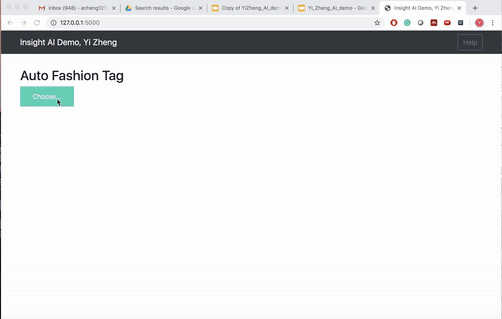

# FashionTag

This is a consulting project to develop a web application to automatically creating fashion tags for images uploaded. The training data is 1 million labelled fashion images from a CVPR 2018 workshop. I used transfer learning to create embedding data of the fashion images to achieve more than 100 times accerlation in the deep neural network training process. Flask was used to develop the web application. The final product is dockerized and can be pull from docker hub. Eventually, I deploy the docker container on google cloud using kubernetes.



## Getting Started

To get the data, please go to the 'Data' folder in this repo for further instructions. To train your own model, you will first need to generate embedding data for the images and store the embedding in your data folder. This will acceccrate your deep neural network training process by trading time complexcity with space complexicity. 


All scripts should be ran from the project root directory, e.g.:

```
python scripts/train.py
```
### Prerequisites

I used tensorflow and keras for the model development on AWS enviroment tensorflow_p36. To install a similar enviroment, you can run pip to install the following packages. I also installed keras-metrics, a package to use customerized metrics to monitor the training process. For the Flask development, you can use the docker file to setup the enviroment.

```
pip install tensorflow==1.13.1
pip install Keras==2.2.4
pip install Keras-Applications==1.0.7
pip install keras-metrics==1.1.0
pip install Keras-Preprocessing==1.0.9
```

## Running the code

The code should be execute in the correct sequence. 

### Download and clean the data

To download the data, you should first download the [training.json file](https://www.kaggle.com/c/imaterialist-challenge-fashion-2018), then run the following code to (1) remove broken links from the json files; (2) download the images using the url links from the json file; (3) create label data

```
python delete_broken_images.py
python scripts/download_images.py ./data/train.json ./data/train
python scripts/create_label.py
```

### Create image embedding data using VGG19

The pretrained CNN model is very large, making the total training process slow eventhough we freeze the weights of the pre-trained model for transfer learning. As the model weight is not being trained, I decided to extract the output of the pretrained CNN model (VGG19) and store it temportatly and use it as embedding data for input for the fully connective network. This way, it is more than hundreads time faster in training. 
```
python scripts/create_embedding.py
```
### Train the fully connected layers using multiple customerized loss functions

Traditionally, a multilabel classification problem will use binary cross-entropy as the cost function. However, due to the sparcity of our target data, in other words, most columns in y are 0. The model can just output all zero to get a high accuracy. This makes it very difficult to train. 


To solve this problem, instead of focusing on the accurcay, I focus on pushing the F1 score of the model, which is a complimize between recall and precision. Therefore, I customerized a loss function based on the F1 score to train the model. 

```
F1 Score = 2*(Recall * Precision) / (Recall + Precision)
Recall = TP/TP+FN
Precision = TP/TP+FP
```


Another difficulty of this project is that our data is highly imbalanced even after label selection. 


Focal loss [https://arxiv.org/abs/1708.02002], is a method developed in the object detection task. In object detection, often, there are a large background, which is easy to identify but occupy most of the data. The model saturated easily in very accuracily predicting a background. However, what we really interested is the a few obejct, which is our positive examples. Focal loss was designed to force the model focus on the few positive examples (outputting 1, not 0). This is similar to our imbalanced class and sparse target data problems. Therefore, I also customerized a focal loss function as our loss function in this project to increase the F1 score. You can see from the graph below, that by using customerized loss function, there is more than 30% boost in F1 score for the minority classes.


To start the training, run the following command lines, which also use tensorboard to monitor the training process. The learning rate can be changed when fine-tuning the selected model.

```
python scripts/train.py
```


## Deployment

I have Flask to deploy the deep learning model to a web application. For more information, please visit [my github page of Flask and Docker](https://github.com/YIZHE12/keras-flask-deploy-webapp). To download and run the docker, you can run the following commands:

```
docker pull echeng1212/keras_flask_app:insightdemo
docker run -d -p 5000:5000 echeng1212/keras_flask_app:insightdemo
```
To deploy the containerized web application on google cloud, you should first register a google cloud account, which will give you $300 credit. Open the console, and create an instance with adequate storage. Without creating your own instance, but run the docker container on the default console will get an out of memory error. Then you can run the following code to build the docker on the cloud, note to set the [PROJECT_ID] in your project ID and your zone to your local zone. You should also have kubernetes preinstalled on your instance.

```
gcloud config set project [PROJECT_ID]
gcloud config set compute/zone us-east-4a

git clone https://github.com/YIZHE12/keras-flask-deploy-webapp
cd keras-flask-deploy-webapp

export PROJECT_ID="$(gcloud config get-value project -q)"
docker build -t gcr.io/${PROJECT_ID}keras-flask-deploy-webapp:v1 .
gcloud auth configure-docker
docker push gcr.io/${PROJECT_ID}/keras-flask-deploy-webapp:v1
```
If you have probelm running 'gcloud auth configure-docker', you can follow this instruction for troubleshooting:
https://techoverflow.net/2019/04/01/fixing-gcloud-warning-docker-credential-gcloud-not-in-system-path/. Note that you can also use Docker pull, tag and push for a prebuild docker container instead of building your own one.

You should then check if the docker is running properly by running it locally on the google cloud VM:
```
docker run --rm -p 5000:5000 gcr.io/${PROJECT_ID}/keras-flask-deploy-webapp:v1
```
Give it a few minutes, when it is ready, you should get a response by running:
```
curl http://localhost:5000
```
After you are sure that it is running, kill the program by using CTRL+C. Now we can start creating the cluster for the web app by:
```
gcloud container clusters create hello-cluster --num-nodes=2
```

Wait for a few minutes, use Kubernetes to create a Deployment named hello-web on your cluster. 
```
kubectl run hello-web --image=gcr.io/${PROJECT_ID}/keras-flask-deploy-webapp:v1 --port 5000
```

Run the following command to check if the deployment is ready, when it is ready, you should see Ready 1/1
```
kubectl get pods
```
Now push it to the Internet:
```
kubectl expose deployment hello-web --type=LoadBalancer --port 80 --target-port 5000
```
Run the following command and check every minute until the eternal IP is avaiable:
```
kubectl get service
```
Now you can use http://[external ip] to test your web app on the internet

To kill the cluster and service, run
```
kubectl delete service hello-web
gcloud container clusters delete hello-cluster
```

For more information, see:
https://cloud.google.com/kubernetes-engine/docs/tutorials/hello-app

## Built With

* [Flask](http://flask.pocoo.org/) - The web framework used
* [Dokcer](https://www.docker.com/) - The container platform
* [Kubernetes](https://kubernetes.io) - The container deployment tool


## Contact information

* **Yi Zheng** :echeng1212@gmail.com 


